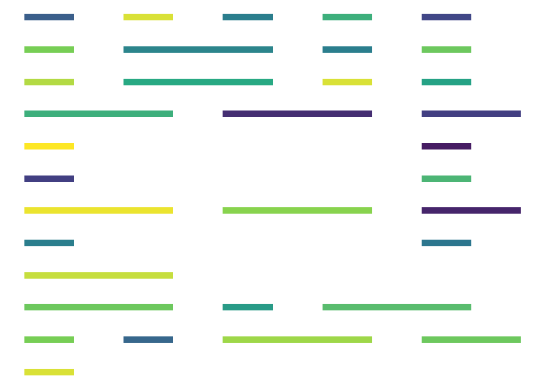

<!-- README.md is generated from README.Rmd. Please edit that file -->

# morsecode

<!-- badges: start -->
<!-- badges: end -->

This package converts text into Morse code, in various formats suitable
for graphing and making art. You probably don’t need this.

## Installation

You can install morsecode with:

``` r
remotes::install_github("xmarquez/morsecode")
```

## Basic usage

The basic functions all use text\_to\_\*:

``` r
library(morsecode)
text <- "Hello I am a text"

text_to_morse_chars(text)
#> [1] ".... . .-.. .-.. ---   ..   .- --   .-   - . -..- -"
```

You can also turn text into binary Morse code:

``` r
text_to_morse_numeric(text)
#>   [1] 1 0 1 0 1 0 1 0 1 0 1 0 1 1 1 0 1 0 1 0 1 0 1 1 1 0 1 0 1 0 1 1 1 0 1 1 1
#>  [38] 0 1 1 1 0 0 0 0 0 0 0 1 0 1 0 0 0 0 0 0 0 1 0 1 1 1 0 1 1 1 0 1 1 1 0 0 0
#>  [75] 0 0 0 0 1 0 1 1 1 0 0 0 0 0 0 0 1 1 1 0 1 0 1 1 1 0 1 0 1 0 1 1 1 0 1 1 1
#> [112] 0
```

Or a data frame, suitable for graphing:

``` r
library(dplyr)
#> 
#> Attaching package: 'dplyr'
#> The following objects are masked from 'package:stats':
#> 
#>     filter, lag
#> The following objects are masked from 'package:base':
#> 
#>     intersect, setdiff, setequal, union
library(ggplot2)

df <- text_to_morse_segments(text, line_length = 10)

df %>%
  ggplot(aes(x = x, xend = xend, y = y, yend = yend,
             color = sample(group))) +
  geom_segment(size = 3, show.legend = FALSE) +
  theme_void() +
  scale_color_viridis_c()
```



Or even sound:

``` r
sound <- text_to_morse_sounds(text, pulse_duration = 0.05,
                              play = FALSE)

audio::play(sound, rate = 8000)
```
